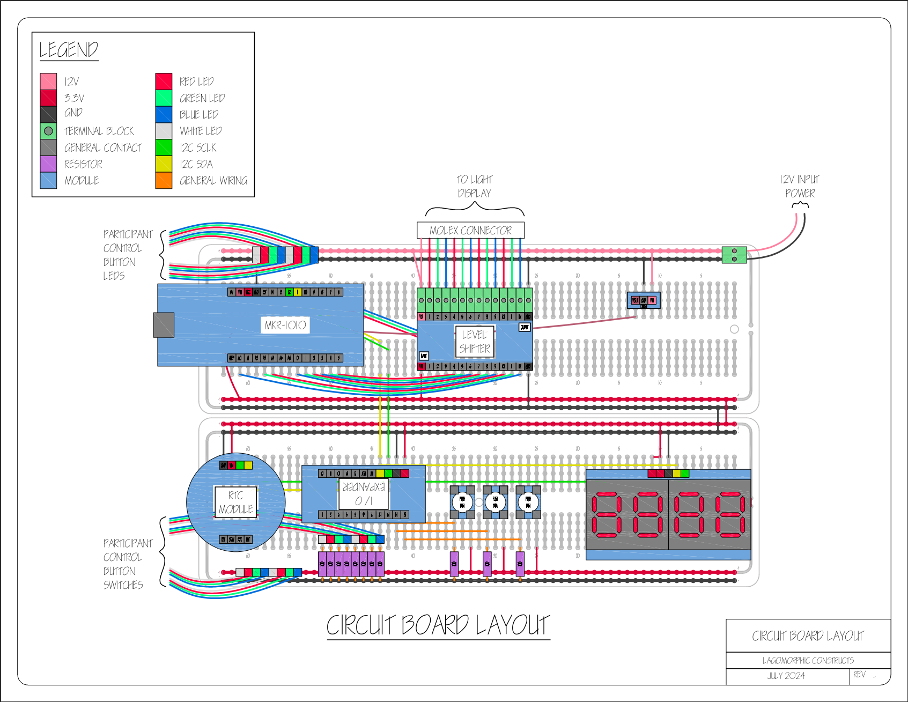

# ColorClock

## Code Location

The code base is contained in the Arduino directory located at
[./sw/arduino/color-clock-driver](./sw/arduino/color-clock-driver).

## Hardware

The project was designed using an `MKR1010` Arduino board that
interfaces with a real time clock module to keep accurate time.

### Wiring Diagram

## Documentation

The blog about this project can be found
[here](http://rebeccarashkin.com/color-clock).

A slide deck that contains an overview of the project can be found
[here](./docs/slide-decks/2024-08-10__demo/_color-clock-demo__2024-08-10.pdf)

## Description

Version 1 of ColorClock was an art piece displayed at Burning Man in
2024. The piece was a minimalist lean-to shade structure, housing a
2.5 ft diameter light display at its core. Within, a bench invited
participants to rest just above the playa. The light display, crafted
with concentric circles, marked the current time, providing nuanced
granularity such as the hour and minute. A user-controllable central
light introduced an element of interactivity. With a control panel,
the participant could manage cycle time and spectrum hues, enhancing the
understanding of the piece. ColorClock, in its simplicity and
interactivity, prompts contemplation on the temporal interplay of light
against the expansive backdrop of the playa landscape.
