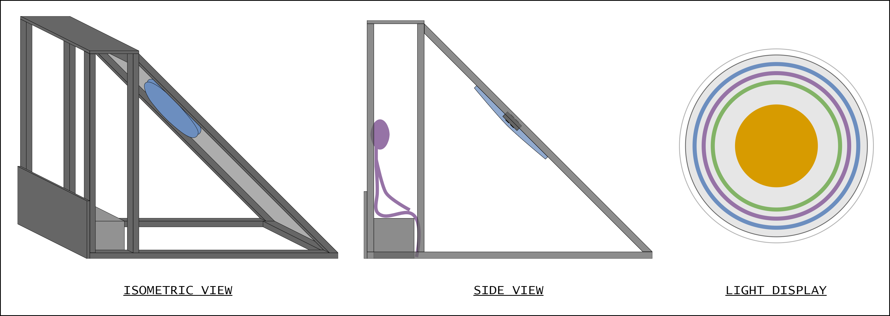

# The mystery of the missing package
sA couple weeks ago I was tearing my house apart to find a package from Adafruit that I remember arriving a couple months prior. I'm not one to put something in a random place (an ongoing challenge I'm actively addressing!), so it turned into a whole week of organizing and repeatedly checking all the logical places it could be. I felt like I was going crazy.

I finally decided to find the email delivery confirmation but it was non existent in my inbox. And then I went to the Adafruit website and found a shopping cart containing all the items I was expecting in my package 😑 Looking at my shopping cart of unpurchased items, the real memory of what happened came flooding back... I was shopping for an encoder but couldn't commit and probably went to bed with intentions of finishing my shopping the next day but life got in the way. Studying my shopping cart, I discovered that one of the items I had planned to purchase was no longer in stock 😫

Lessons learned:
1. When having trouble finding a mailed package, first check if the items were ever ordered.
2. Don't put off ordering a shopping cart full of items in hopes of finding that last perfect addition.

# A new Arduino
One of the other items I had ordered that week was a new, smaller Arduino board. I have been using this old board I acquired from my brother years earlier that he was never able to connect to (it turns out he was using a power cable instead of a data cable to program 😅). For the final ColorClock installation, I want to make two identical circuit boards so I have a backup in case there are any problems during the week the project is being displayed.

I ordered an Arduino Nano ESP32 where nearly all of the pins are configurable to have PWM, a way to fake out an analog output with a digital signal. PWM output is what I need to have variable output voltage so I can send different outputs to the RGB LED pins creating different colors.

# Nothing good is ever easy
So, I had this new Arduino and I just wanted to do a simple test so that I know I can program my new Arduino. In my last post I shared my frustration with figuring out how to set build variables so I went back to developing on my beloved decade-old MacBook Pro. But after I figured out how to set build variables I migrated back to my new fancy Windows machine and applied the same changes to the `boards.txt` deep in the file system in the Arudino hardware folder. At that point I continued development on Windows.

Ok, so back to the new Arduino board... I installed the drivers to talk to this board but I kept getting errors when trying to program it:

```
dfu-util: Cannot open DFU device 2341:0070 found on devnum 10 (LIBUSB_ERROR_ACCESS)
dfu-util: No DFU capable USB device available
Failed uploading: uploading error: exit status 74
```

I discovered that this was a known problem with this board and found in the Arduino forums that there is a [`post_install.sh`](https://arduino.github.io/arduino-cli/0.35/platform-specification/#post-install-script) script I need to run for the computer for computer to see the Arduino. But this was a Bash script, and I was developing on Windows. I tried running the command in Git Bash, but I needed to use `sudo` and Git Bash didn't have `sudo` then I tried to run it in PowerShell just for fun.

## A side note
Skipping ahead to the present, as I'm cleaning up this post and adding links, I have discovered that there is indeed a `post_install.bat` script that I probably could have run on Windows, but we're here now.

# A solution to my development woes
The time had come to create a Linux partition. I was experiencing the same level of fear I had about `arduino-cli`, the command line tool for building and uploading Arduino code. Creating a Linux partition seemed scary because I had never done it before. But dammit I am a software engineer and I can do hard things!

My supportive partner assured me that installing a Linux partition was not complicated. All I needed to do was download the Linux installer, put it on a USB drive, make it bootable, then boot into that USB drive. *deep breath* I can do this.

Creating a bootable USB was surprisingly painless. There are tons of instructions on the internet. The basic steps were:
1. Download the Linux installer image.
1. Make the USB stick bootable.
1. Restart the computer and enter the BIOS.
1. Select the USB from the boot menu.
1. Follow on-screen instructions.

So I did it! I am actually writing this from my Ubuntu partition right now!

Like any new computer, there's the initial setup process, which, in my case, was missing even basic tools like Vim. But I'm no stranger to starting over.

# Back to the new Arduino
The catalyst for the Linux partition was so that I could run a script that would allow my computer to see the Arudino Nano ESP32. I did all the things (installed `arduino-cli`, ran the `post_install.sh` script) and it's all working!

My next challenge is to test my new RTC module, test the I/O expander 🥺 (also scary) and start laying out the 'final' V1 version of the circuit board.

# It's official
I almost forgot to report some other fantastic news! ColorClock is officially listed as 2024 Playa Art!!

[](https://burningman.org/event/2024-art-installations/?yyyy=&aq=colorclock&support_project=0)

---
LinkedIn summary

I'm thrilled to announce a new update on ColorClock's progress! Facing challenges with Arduino programming on Windows, I took a significant step forward by creating a Linux partition to reduce the development struggle. Check out my blog to stay in the loop.